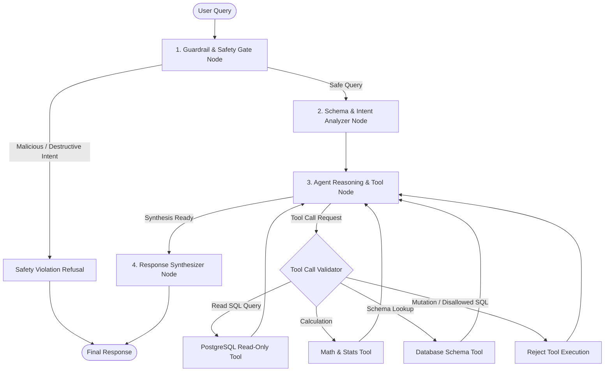
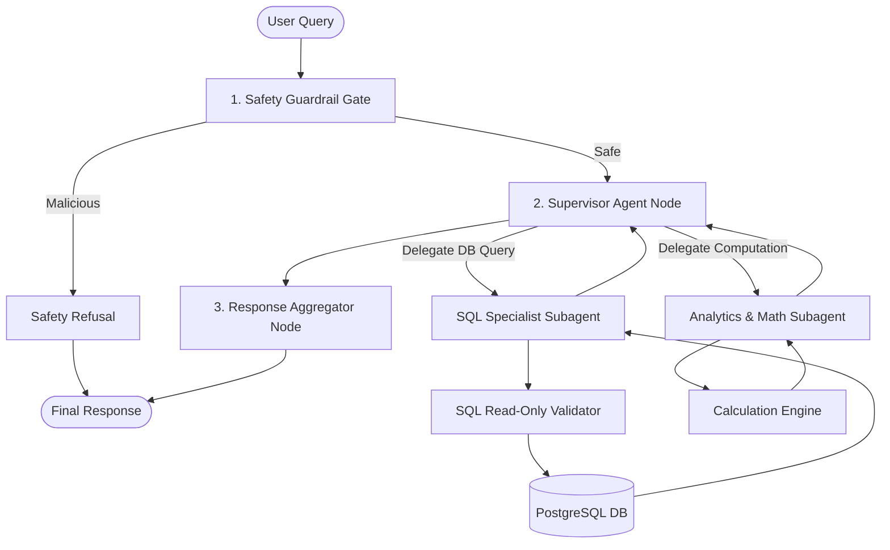
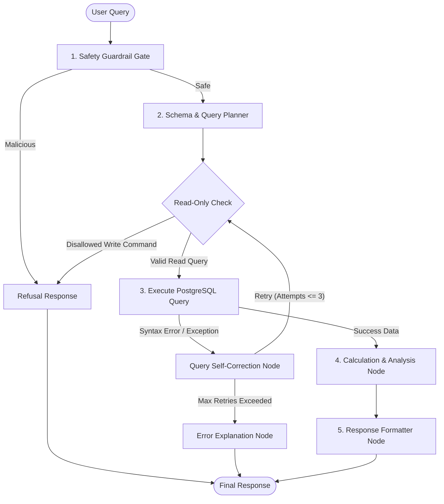

# Plan: Agentic Chatbot Integration with Graph Architecture & Safety Guardrails

## 1. Goal
Integrate an intelligent, graph-orchestrated agentic chatbot into the eCommerce & Machine Learning Pipeline application powered by Google AI Studio (`google-genai` / `langchain-google-genai` / `langgraph`). The chatbot will analyze user inquiries, inspect the database schema, safely execute read-only PostgreSQL queries, compute complex mathematical and statistical calculations, block malicious or destructive intents instantly, and present structured answers with reasoning traces via FastAPI REST endpoints and an interactive frontend UI.

---

## 2. Context & Background
The application currently features a 5-table PostgreSQL schema (`categories`, `customers`, `products`, `orders`, `order_items`), a Machine Learning analytics suite, and a FastAPI backend with a static HTML frontend. 

Users need the ability to ask natural-language questions regarding sales, inventory, customers, order fulfillment, and metrics (e.g., *"What is the total revenue by category this quarter?"* or *"Calculate the average order value for repeat customers vs one-time buyers"*). 

The agentic system requires:
1. **Strict Safety & Guardrails**: Immediate refusal and cutoff for any destructive commands (`DROP`, `DELETE`, `UPDATE`, `INSERT`, `ALTER`, `TRUNCATE`, `GRANT`, prompt injection, data exfiltration).
2. **Read-Only Database Enforcement**: Multi-layer security (semantic prompt level + deterministic AST/regex validation + read-only transaction mode) preventing any write queries.
3. **Calculation & Math Tools**: Safe computation sandbox for arithmetic, averages, ratios, and percentages.
4. **Graph-Based Agentic Architecture**: A stateful graph (using LangGraph) orchestrating safety verification, schema lookup, query execution, and response synthesis for single-query requests without unnecessary context baggage.
5. **Full API & UI Integration**: A dedicated chat endpoint and responsive frontend UI widget with SQL/tool inspection.

---

## 3. Scope

### IS IN SCOPE:
- **Dependencies & Environment Configuration**:
  - Add `google-genai`, `langgraph`, `langchain`, `langchain-core`, and `langchain-google-genai` to `pyproject.toml`.
  - Configure `GEMINI_API_KEY` and model configuration in `src/config.py` and `.env`.
- **Safety & Malicious Intent Guardrail Module (`src/agent/guardrails.py`)**:
  - Semantic and regex-based prompt injection / jailbreak / malicious intent detection.
  - Strict SQL mutation blocker (rejects `INSERT`, `UPDATE`, `DELETE`, `DROP`, `ALTER`, `TRUNCATE`, `GRANT`, `REVOKE`, `EXEC`, `CREATE`).
  - Safe error and rejection messaging format.
- **Read-Only SQL & Calculation Tools (`src/agent/tools.py`)**:
  - `get_database_schema`: Returns tables, columns, types, foreign key relationships, and sample values.
  - `execute_sql_query`: Enforces read-only validation, executes query against PostgreSQL using `get_dict_connection()`, formats results, and caps output rows.
  - `compute_math`: Safe evaluation of math expressions, aggregations, percentages, ratios, and statistical calculations.
- **Graph Agent Workflow Architecture (`src/agent/graph.py` & `src/agent/prompts.py`)**:
  - LangGraph `StateGraph` definition with custom `AgentState` schema.
  - Specialized nodes: Guardrail Gate, Schema/Intent Analyzer, Agent Reasoning / Tool Calling loop, and Response Synthesizer.
  - Configurable support for fallback execution and error self-correction.
- **Pydantic Schemas (`src/schemas/agent.py`)**:
  - Request schema (`query: str`, `temperature: float | None`).
  - Response schema (`response: str`, `safety_status: str`, `steps: list`, `sql_queries: list`, `calculations: list`, `execution_time_ms: float`).
- **FastAPI Endpoints (`src/api/v1/endpoints/agent.py` & `src/api/v1/router.py`)**:
  - `POST /api/v1/agent/chat`: Process query through the agent graph and return structured response.
  - `GET /api/v1/agent/status`: Return agent health, model details, tool capabilities, and safety status.
  - `GET /api/v1/agent/schema`: Return available database schema context exposed to the agent.
- **Frontend Chat Interface (`html/index.html`)**:
  - Dedicated "AI Assistant / Agentic Chat" interface with message bubble timeline.
  - Collapsible panels for SQL query inspector, raw tool outputs, and execution metrics.
  - Quick query chips (e.g., *"Top 5 highest spending customers"*, *"Revenue breakdown by category"*, *"Average discount by order status"*).
  - Safety alert badges when an unsafe query is blocked.
- **Testing Suite (`tests/test_agent_*.py`)**:
  - `tests/test_agent_safety.py`: Test malicious prompt detection, SQL write attempts (`DROP`, `DELETE`, `UPDATE`), and refusal behavior.
  - `tests/test_agent_tools.py`: Test `get_database_schema`, `execute_sql_query` (valid read queries vs blocked writes), and `compute_math`.
  - `tests/test_agent_graph.py`: Test graph state execution, node routing, tool dispatch, and synthesis.
  - `tests/test_agent_api.py`: Test `/api/v1/agent/chat`, `/api/v1/agent/status`, error handling, and payload validation.

### IS NOT IN SCOPE:
- Multi-turn persistent conversational memory across server restarts (explicitly excluded by prompt requirements for Phase 1 single-query testing).
- Database write operations (strictly prohibited).
- External unauthenticated third-party APIs.

---

## 4. Architectural Designs (Mermaid Graphs)

### Option 1: Guardrail-Gated Multi-Stage Reasoner Graph *(Recommended)*
> **Description**: A high-assurance pipeline that runs a deterministic safety check prior to invoking LLM reasoning, routes clean queries to an agentic tool-calling loop equipped with SQL safety middleware, and synthesizes answers with transparent execution logs.

* **Rationale**: Provides the best balance of strict security, minimal token overhead, explainable execution traces, and high reliability.

---

### Option 2: Supervisor-Worker Subagent Graph
> **Description**: A multi-agent hierarchy where a central supervisor receives the query and coordinates specialized worker agents (`SQL Specialist Agent` and `Calculation Analyst Agent`).

* **Rationale**: Strong functional separation, but introduces extra latency and token cost for simple analytical questions.

---

### Option 3: Dynamic Self-Correcting Graph (Query-Execute-Verify Loop)
> **Description**: A cyclic graph that generates SQL, attempts execution, and automatically routes SQL syntax or schema runtime errors into a dedicated reflection/fixer loop before computing results.

* **Rationale**: High fault-tolerance against complex SQL syntax errors, with explicit loop bounds.

---

## 5. Security & Safety Guardrail Specification

| Category | Policy / Rule | Enforcement Mechanism |
| :--- | :--- | :--- |
| **Malicious Intent / Abuse** | Reject prompt injections, jailbreaks, requests to bypass safeguards, or harmful system prompts. | Regex pattern matcher + system prompt constraints + immediate cutoff. |
| **Write/DDL Protection** | Disallow `INSERT`, `UPDATE`, `DELETE`, `DROP`, `ALTER`, `TRUNCATE`, `CREATE`, `GRANT`, `REVOKE`, `EXEC`, `VACUUM`. | Deterministic AST/token parser intercepting all SQL execution requests before reaching the database driver. |
| **Read-Only Database Connection** | Execute all queries inside a `SET TRANSACTION READ ONLY` or read-only cursor session. | `psycopg` connection settings ensuring PostgreSQL rejects any mutation attempts at the engine level. |
| **Row Limits & Performance** | Limit maximum returned rows (default `LIMIT 100`) to prevent memory exhaustion and high payload costs. | Automatic query pagination / `LIMIT` injection if omitted by the agent. |

---

## 6. Implementation Steps

1. **Phase 1: Environment & Dependencies**
   - Update `pyproject.toml` with `google-genai`, `langgraph`, `langchain`, `langchain-core`, `langchain-google-genai`.
   - Run `uv sync` to lock dependencies.
   - Update `src/config.py` with `gemini_api_key`, `gemini_model` (e.g. `gemini-2.5-flash` / `gemma-4-31b-it`), and agent settings.

2. **Phase 2: Safety & Tools Layer**
   - Create `src/agent/guardrails.py` with safety filters and SQL write blockers.
   - Create `src/agent/tools.py` with `get_database_schema`, `execute_sql_query`, `compute_math`.
   - Write comprehensive tests in `tests/test_agent_safety.py` and `tests/test_agent_tools.py`.

3. **Phase 3: Graph Agent Architecture**
   - Create `src/agent/prompts.py` containing specialized system prompts and safety guidelines.
   - Create `src/agent/graph.py` defining the `StateGraph`, nodes, edges, state reducers, and invocation pipeline.
   - Write unit and workflow tests in `tests/test_agent_graph.py`.

4. **Phase 4: REST API Endpoints**
   - Create `src/schemas/agent.py` defining input/output Pydantic models.
   - Create `src/api/v1/endpoints/agent.py` implementing `/chat`, `/status`, and `/schema`.
   - Register the router in `src/api/v1/router.py`.
   - Write API tests in `tests/test_agent_api.py`.

5. **Phase 5: Frontend Chat Interface**
   - Update `html/index.html` to add an interactive Chatbot Assistant panel and quick query chips.
   - Add collapsible inspect panels for SQL statements executed, calculations performed, and safety status badges.

6. **Phase 6: Verification & Quality Gate**
   - Run `./scripts/flow verify` (pytest test suite, test coverage >= 60%, flake8, black).
   - Verify zero lint/formatting issues and 100% passing tests.

7. **Phase 7: Documentation & Rollup**
   - Create developer documentation in `docs/agent.md`.
   - Update `README.md` and `docs/api.md`.
   - Complete worklog summary and rollup.

---

## 7. Files Touched

| Path | Change Type | Risk Level | Why |
| :--- | :--- | :--- | :--- |
| `pyproject.toml` / `uv.lock` | Modify | Low | Add `google-genai`, `langgraph`, `langchain`, `langchain-google-genai`. |
| `src/config.py` | Modify | Low | Add Gemini API credentials and model configuration settings. |
| `src/schemas/agent.py` | Add | Low | Pydantic schemas for chat requests, responses, and step traces. |
| `src/agent/__init__.py` | Add | Low | Agent package initialization. |
| `src/agent/guardrails.py` | Add | Medium | Core safety filters and SQL write-query blocker. |
| `src/agent/tools.py` | Add | Medium | Read-only SQL executor, schema inspector, and math evaluator. |
| `src/agent/prompts.py` | Add | Low | System instructions, role definitions, and few-shot guidance. |
| `src/agent/graph.py` | Add | High | LangGraph StateGraph agent workflow and state orchestration. |
| `src/api/v1/endpoints/agent.py` | Add | Medium | REST API endpoints for chatbot interaction and status. |
| `src/api/v1/router.py` | Modify | Low | Register agent endpoints router. |
| `html/index.html` | Modify | Medium | Add AI Chatbot interactive UI and SQL inspection panels. |
| `tests/test_agent_safety.py` | Add | Low | Unit tests for malicious intent blocking & SQL write rejection. |
| `tests/test_agent_tools.py` | Add | Low | Unit tests for schema tool, SQL read tool, and math tool. |
| `tests/test_agent_graph.py` | Add | Medium | Integration tests for graph state transitions and execution. |
| `tests/test_agent_api.py` | Add | Low | Integration tests for `/api/v1/agent/*` endpoints. |
| `docs/agent.md` | Add | Low | Documentation of agent architecture, safety rules, and tools. |
| `docs/api.md` | Modify | Low | Document new Agent REST API routes. |

---

## 8. Risk Matrix & Mitigations

| Risk | Likelihood | Impact | Mitigation |
| :--- | :--- | :--- | :--- |
| **Accidental SQL Mutation / Data Alteration** | Low | Critical | Triple-layer protection: (1) Prompt guardrails, (2) Deterministic regex & AST SQL parser rejecting non-`SELECT` statements, (3) PostgreSQL read-only session mode. |
| **Prompt Injection / Harmful Exploits** | Medium | High | Dedicated Guardrail Gate node running pre-execution validation; immediate refusal and response cutoff. |
| **API Rate Limits / Model Timeouts** | Medium | Medium | Graceful error handling, configurable timeouts, and detailed error messages returned to user. |
| **Malformed SQL Generation** | Medium | Low | Schema injection in system prompt + automated retry / self-correction capabilities in the graph workflow. |

---

## 9. Definition of Done
- [ ] Feature branch `feature/agent-integration` created and tracked.
- [ ] Safe, read-only SQL execution and calculation tools implemented and verified.
- [ ] Malicious prompt and write query blocking thoroughly tested.
- [ ] LangGraph graph architecture compiled and integrated with Google GenAI.
- [ ] REST API endpoints `/api/v1/agent/chat`, `/api/v1/agent/status`, `/api/v1/agent/schema` operational.
- [ ] Interactive UI panel embedded in `html/index.html` with real-time query execution and SQL viewer.
- [ ] All automated tests passing (`pytest tests/ --cov=src` >= 60%).
- [ ] Linter (`flake8`) and formatter (`black`) pass with zero errors.
- [ ] Documentation updated in `docs/agent.md`, `docs/api.md`, and `README.md`.
