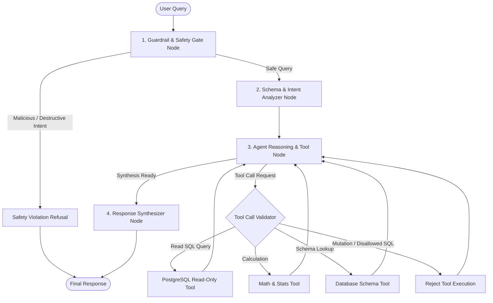

# Agentic Analytics Chatbot Architecture & Safety Guide

The Agentic Analytics Chatbot subsystem integrates Google AI Studio with a compiled LangGraph workflow to empower natural-language data inquiries, schema analysis, read-only PostgreSQL queries, safe mathematical calculations, and robust safety guardrails.

---

## Architecture: Guardrail-Gated Multi-Stage Reasoner Graph



---

## 1. Multi-Layer Safety & Guardrails

| Layer | Component | Protection |
| :--- | :--- | :--- |
| **Layer 1: Input Gate** | `src/agent/guardrails.py:is_malicious_prompt` | Regex & pattern detector intercepting prompt injections, jailbreak instructions, credentials dumping, or hostile bypasses before reaching any model reasoning or database connection. |
| **Layer 2: SQL Validation Middleware** | `src/agent/guardrails.py:validate_sql_safety` | Deterministic token & AST parser intercepting all generated SQL queries. Only `SELECT`, `WITH`, and `EXPLAIN` statements are permitted. Mutations (`DROP`, `DELETE`, `UPDATE`, `INSERT`, `ALTER`, `TRUNCATE`, `GRANT`, `REVOKE`, etc.) are blocked immediately. |
| **Layer 3: Database Engine Guard** | `src/agent/tools.py:execute_sql_query` | Every query execution enforces PostgreSQL `SET TRANSACTION READ ONLY;` at the session level and caps row payloads to prevent memory exhaustion. |
| **Layer 4: Math Sandbox** | `src/agent/tools.py:compute_math` | Restricts computation strictly to mathematical operators, numeric primitives, and safe aggregate operations (`sum`, `min`, `max`, `len`, `abs`, `round`, `pow`, `math.*`), completely banning dangerous builtins (`__import__`, `eval`, `exec`, `open`, `os`, `sys`). |

---

## 2. Tools Catalog

- `get_database_schema()`: Inspects metadata for the 5 relational tables (`categories`, `customers`, `products`, `orders`, `order_items`), column data types, nullability constraints, and record counts.
- `execute_sql_query(query: str, max_rows: int = 100)`: Safely executes validated read-only SQL queries against the active PostgreSQL database.
- `compute_math(expression: str)`: Evaluates financial, percentage, ratio, and statistical formulas safely.

---

## 3. REST API Reference

### `POST /api/v1/agent/chat`
Processes an analytical question through the LangGraph reasoning workflow.

**Request Body:**
```json
{
  "query": "What are the top 5 highest selling products by revenue?",
  "temperature": 0.2
}
```

**Response Body:**
```json
{
  "query": "What are the top 5 highest selling products by revenue?",
  "is_safe": true,
  "violation_reason": null,
  "response": "Here are the top 5 highest selling products by revenue...",
  "steps": [
    {
      "step": "guardrail_check",
      "status": "passed",
      "detail": "Input verified safe.",
      "timestamp": "2026-09-01T00:33:00Z"
    },
    {
      "step": "schema_analysis",
      "status": "completed",
      "detail": "Analyzed schema across 5 managed tables.",
      "timestamp": "2026-09-01T00:33:01Z"
    },
    {
      "step": "sql_execution",
      "status": "success",
      "detail": "Executed query with 5 rows returned.",
      "query": "SELECT p.name, sum(oi.subtotal) as total_revenue ...",
      "timestamp": "2026-09-01T00:33:02Z"
    },
    {
      "step": "response_synthesis",
      "status": "completed",
      "detail": "Synthesized final answer for user.",
      "timestamp": "2026-09-01T00:33:03Z"
    }
  ],
  "sql_queries": [
    {
      "success": true,
      "query": "SELECT p.name, sum(oi.subtotal) as total_revenue FROM products p JOIN order_items oi ON oi.product_id = p.id GROUP BY p.name ORDER BY total_revenue DESC LIMIT 5;",
      "row_count": 5,
      "rows": [...]
    }
  ],
  "calculations": [],
  "execution_time_ms": 312.45
}
```

### `GET /api/v1/agent/status`
Returns operational health, active LLM model (`gemma-4-31b-it`), provider (`Google AI Studio`), guardrails, and registered tools.

### `GET /api/v1/agent/schema`
Exposes the database schema catalog accessible to the agent.
