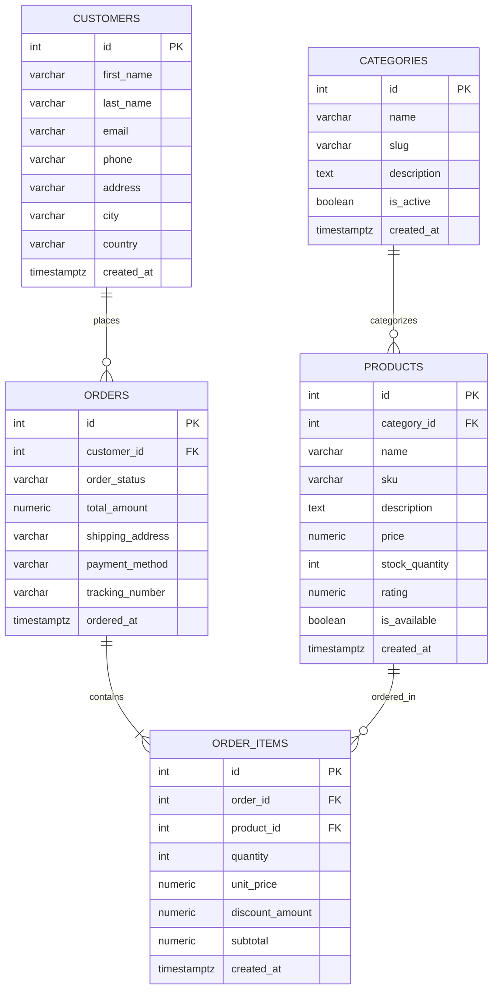

# Project Architecture & Relational Schema

## System Overview

```
┌─────────────┐     HTTP / JSON      ┌──────────────────┐     SQL (psycopg)   ┌────────────┐
│  html/      │ ◄──────────────────► │  src/main.py     │ ──────────────────► │ PostgreSQL │
│  Dashboard  │                      │  (FastAPI + v1)  │                     │ (local)    │
└─────────────┘                      └──────────────────┘                     └────────────┘
                                              │
                                              ▼
                                     ┌──────────────────┐
                                     │  src/db/schema   │
                                     │  src/db/seed     │
                                     │  src/schemas     │
                                     │  src/api/v1      │
                                     └──────────────────┘
```

## Relational Database Schema (5 Tables)

Each table is designed with 5–10 columns, standard primary keys, indices, and foreign key constraints:



## Seed Record Counts

| Table | Columns | Seed Count | Notes |
| --- | --- | --- | --- |
| `categories` | 6 | 10 | Root taxonomy |
| `customers` | 9 | 40 | Realistic buyer profiles |
| `products` | 10 | 30 | Catalog with price, rating, stock |
| `orders` | 8 | 60 | Order headers with statuses |
| `order_items` | 8 | **200** | **Largest table** (200 records) |

## Modules & Responsibilities

| Path | Responsibility |
| --- | --- |
| `src/database.py` | Connection pools, context managers (`get_dict_connection`, `get_connection`). |
| `src/db/schema.py` | DDL schema creation, table truncation, schema dropping, metadata inspection. |
| `src/db/seed.py` | Seed generator creating 200 records in `order_items` and dependent entities. |
| `src/schemas/models.py` | Pydantic response models, pagination envelopes, and analytics models. |
| `src/api/v1/` | Modular REST API routers with search, filters, pagination, and sorting. |
| `html/index.html` | Zero-dependency responsive data explorer and management dashboard. |
