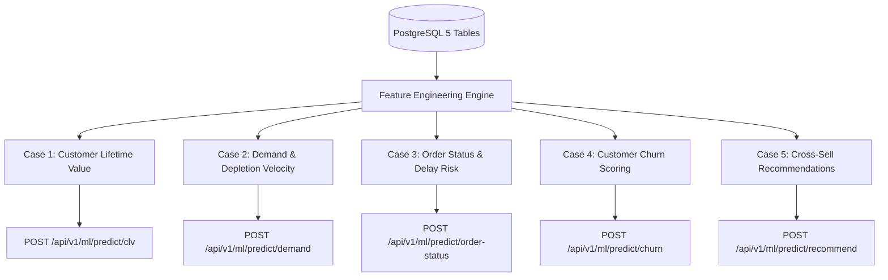

# Machine Learning Analytics & Inference Pipeline

The Machine Learning subsystem delivers predictive analytics and personalized intelligence directly over the 5-table PostgreSQL relational schema (`categories`, `customers`, `products`, `orders`, `order_items`).

Exclusively utilizing traditional `scikit-learn` algorithms and advanced **hybrid ensembles** (Voting, Stacking, Pipeline Scaling), the subsystem provides real-time REST API inference and interactive UI tooling for 5 core business cases.

---

## 5 Identified Business Cases

### 1. Customer Lifetime Value (CLV) & VIP Spending Tier
* **Problem**: Predict prospective customer lifetime revenue ($) and classify high-value VIP accounts ($450+ total spend).
* **Features**: Historical order count, average order value, total units purchased, average unit price, total discount received, days since first purchase.
* **Architecture**: **Hybrid Ensemble**
  * *Regression*: `VotingRegressor` (StandardScaler + Ridge + RandomForest + GradientBoosting)
  * *Classification*: `VotingClassifier` (Soft voting: LogisticRegression + RandomForest + GradientBoosting)
* **Metrics**: $R^2$, RMSE, MAE, Accuracy, F1-Score, ROC-AUC.

### 2. Product Demand & Inventory Depletion Velocity
* **Problem**: Forecast catalog unit sales demand and assess inventory burn rates to guide restock procurement.
* **Features**: Product category, unit price, current stock quantity, star rating, monthly order frequency, average discount.
* **Architecture**: `Pipeline` (`StandardScaler` + `GradientBoostingRegressor`)
* **Metrics**: $R^2$, RMSE, Inventory Depletion Ratio.

### 3. Order Fulfillment Status & Delivery Delay Risk
* **Problem**: Predict order fulfillment delay risk to alert logistics teams before bottlenecks occur.
* **Features**: Basket monetary total, line item count, payment method code, destination city code, discount applied, days elapsed.
* **Architecture**: `VotingClassifier` (Soft voting: LogisticRegression + RandomForest + GradientBoosting)
* **Metrics**: F1-Score, Precision, Recall, ROC-AUC.

### 4. Customer Churn Risk & Retention Scoring
* **Problem**: Detect accounts at risk of churning due to purchase inactivity and low ordering velocity.
* **Features**: Days since last order, total orders, days since signup, total spend, average days between orders, distinct categories purchased.
* **Architecture**: 4-Model Soft-Voting Ensemble (LogisticRegression + SVC + RandomForest + GradientBoosting)
* **Metrics**: F1-Score, ROC-AUC, Recall.

### 5. Cross-Sell & Basket Affinity Recommendation
* **Problem**: Generate personalized next-best product recommendations for customers.
* **Architecture**: **Hybrid Recommender**
  * Collaborative filtering: Item-based Cosine `NearestNeighbors` over Customer-Product matrix.
  * Content & quality weighting: Blends item ratings and price tiers to resolve cold-start sparsity.
* **Metrics**: Precision@3, NDCG.

---

## API Summary

| Endpoint | Method | Purpose |
| :--- | :--- | :--- |
| `/api/v1/ml/cases` | GET | List 5 business cases & specifications |
| `/api/v1/ml/experiments` | GET | Run & return model comparison benchmarks |
| `/api/v1/ml/report` | GET | Get comprehensive Markdown & JSON report |
| `/api/v1/ml/train` | POST | Retrain all 5 pipelines on latest DB |
| `/api/v1/ml/predict/clv` | POST | Predict CLV spend & VIP classification |
| `/api/v1/ml/predict/demand` | POST | Predict unit demand & depletion risk |
| `/api/v1/ml/predict/order-status` | POST | Predict order delay & fulfillment status |
| `/api/v1/ml/predict/churn` | POST | Predict customer churn probability |
| `/api/v1/ml/predict/recommend` | POST | Generate Top-K product recommendations |
